# electromagnetic-waves-with-arduino
In questo progetto utilizzeremo una scheda Arduino UNO R3 e un dispositivo chiamato fototransistor per studiare le onde elettromagnetiche, in particolar modo quelle della luce visibile. Esploreremo alcune delle applicazioni di rilevamento e misurazione della luce e anche tecnologie di comunicazione e radar.

## Premessa
Ho realizzato questo progetto nell'ambito di una relazione presentata al corso di **Tecnico e sistemista di reti** che ho frequentato presso il centro [Enaip Piemonte di Cuneo](https://www.enaip.piemonte.it/page/corsi/corso/TECNICO-SISTEMISTA-DI-RETI__23378____.html) (Italia). Ho seguito questo corso di specializzazione professionale principalmente per acquisire competenze sull'_hardware_ e sui processi connessi, e per integrare queste competenze a quelle in ambito di _web design_ già in parte maturate nel corso dell'esperienza lavorativa.

## Sintesi del progetto
Il progetto si divide in due esperimenti.
1. **Sensore di luminosità**: nel primo esperimento utilizzeremo un fototransistor come sensore per misurare l'intensità della luce. Inizieremo costruendo un circuito base per un sensore di luce analogico. Utilizzeremo il sensore per misurare la luce ambientale nella stanza ed esploreremo come il valore analogico emesso dalla scheda Arduino UNO R3 sia correlato alla luminosità della luce nella stanza. Poi esamineremo come viene utilizzata la luce nelle **fibre ottiche** per comunicare grandi quantità di informazioni ad alta velocità. Sebbene non si utilizzerà un cavo a fibre ottiche in questa attività, potremo comunque vedere il principio di base di come un trasmettitore invia informazioni attraverso le onde luminose a un ricevitore che le rileva e ne interpreta le informazioni.
2. **Radar di onde luminose**: nella seconda parte dell'esperimento utilizzeremo il sensore di luce come un radar che mappa l'intensità della luce della stanza, collegando il fototransistor ad un servo motore che viene controllato manualmente usando i comandi immessi attraverso il monitor seriale dell'IDE Arduino.

Entrambi gli esperimenti sono stati realizzati in parte utilizzando le guide e le risorse messe a disposizione dall'[Arduino Student Kit](https://www.arduino.cc/education/student-kit), un programma di studio per imparare l'elettronica e le basi di programmazione, progettato specificamente per l'istruzione domestica e l'apprendimento a distanza.

Il codice sviluppato e utilizzato per il progetto è interamente disponibile nella cartella `arduino_code` ed è suddiviso in due parti: `sketch_electromagneticWaveRadar`; `sketch_electromagneticWaveRadar_withServoMotor`.

## Parte 1 - Sensore di luminosità
Il sensore di luce è uno dei sensori più comunemente utilizzato oggigiorno. I telefoni cellulari hanno, ad esempio, sensori di luce che vengono utilizzati dalla fotocamera, per sapere se attivare o meno il flash, quando scattiamo una foto. I lampioni, le luci delle automobili e le luci nei giardini comunali, sono spesso dotati di sensori, che accendono le luci al tramonto. I sistemi di sicurezza utilizzano spesso sensori di luce per modificare le impostazioni di sicurezza durante la notte. Naturalmente, ci sono diversi tipi di sensori di luce. Alcuni rilevano la luminosità, mentre altri rilevano il colore. Diversi tipi di sensori rilevano anche diversi tipi di luce, come ultravioletti, infrarossi e raggi X. In questa attività, costruiremo un sensore di luce analogico, utilizzando una scheda Arduino UNO R3 e un fototransistor, per misurare l'intensità della luce nella stanza.

### Componenti necessari
- 1 scheda elettronica Arduino UNO R3
- 1 fototransistor
- 1 resistenza da 10K Ohm
- 1 resistenza da 220 Ohm
- 1 LED
- 2 cavetti jumper femmina-maschio
- 2 cavi di alimentazione (rosso/nero)
- 6 cavetti jumper

Un **fototransistor** è un componente elettronico che converte l'energia della luce in energia elettrica. In un certo senso, lavora in modo opposto ad un LED. Un LED, infatti, converte l'energia elettrica in energia luminosa. Quando gli elettroni fluiscono, vengono emesse particelle di luce chiamate fotoni e viene prodotta la luce. Se questo processo viene invertito, il LED diventa un fotodiodo e può essere utilizzato per rilevare la luce. Quando la luce lo colpisce, l'energia luminosa viene convertita in energia elettrica e viene prodotto un certo ammontare di corrente. Il problema però, è che la corrente prodotta da un fotodiodo è solitamente molto debole. Tuttavia, se si combina il fotodiodo con un transistor, si può amplificare la corrente e renderla utile per il circuito.

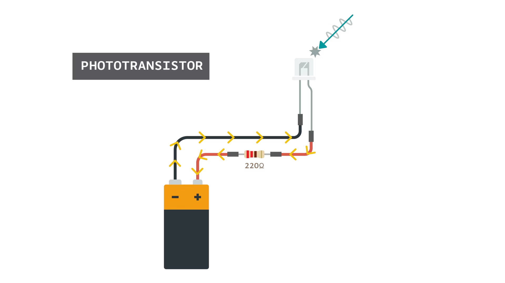
<sub>Fonte immagine: [Arduino Student Kit](https://www.arduino.cc/education/student-kit).</sub>

### Schema elettrico
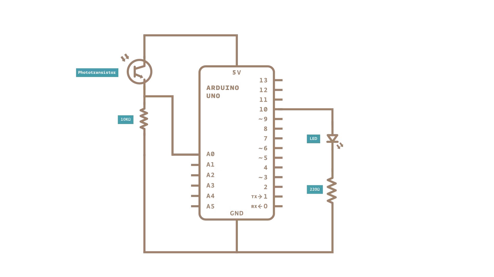
<sub>Fonte immagine: [Arduino Student Kit](https://www.arduino.cc/education/student-kit).</sub>

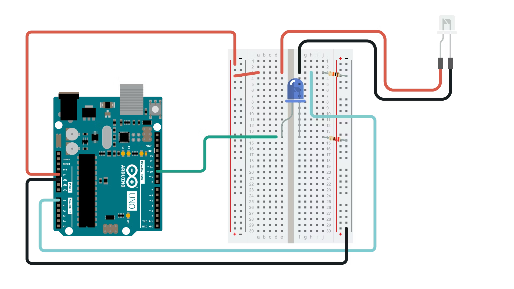
<sub>Fonte immagine: [Arduino Student Kit](https://www.arduino.cc/education/student-kit).</sub>

Circuito costruito.

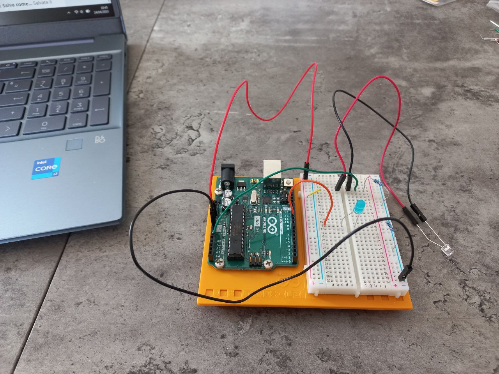
<sub>Fonte immagine: produzione propria dell'autore.</sub>

### Misurazione della luce
Inizieremo a scrivere il codice che controlla il circuito. Questo primo sketch consentirà di utilizzare il fototransistor come sensore per rilevare la luminosità o l'intensità della luce nella stanza. Per il momento, ci concentreremo solo sulla creazione del codice per il sensore di luce. Successivamente, aggiungeremo il codice per controllare il LED utilizzandolo come sorgente luminosa.

```c++
// nome dei pin della scheda Arduino utilizzati dal circuito
const int sensorPin = A0;
 
// variabili dichiarate
int lightAmount = 0;

void setup() {
  // codice di installazione, eseguito una volta:

  // avvia il monitor seriale
  Serial.begin(9600);
}

void loop() {
  // codice principale, eseguito ripetutamente:

  // legge il sensore di luce e memorizza la misura in una variabile
  lightAmount = analogRead(sensorPin);
  
  // informazioni di output al monitor seriale
  Serial.print("Light Intensity: ");
  Serial.println(lightAmount);
  
  delay(1000);
}

```
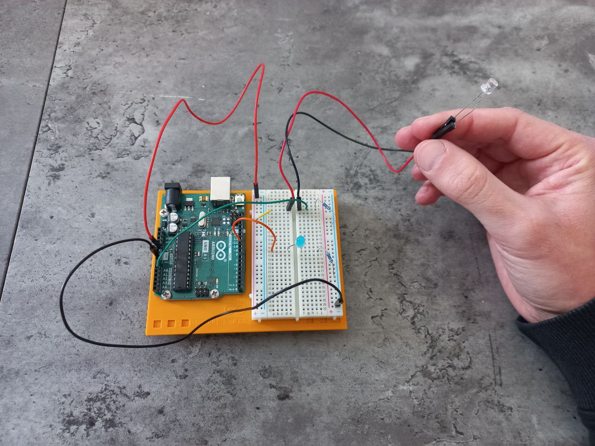
<sub>Fonte immagine: produzione propria dell'autore.</sub>


<sub>Fonte immagine: produzione propria dell'autore.</sub>

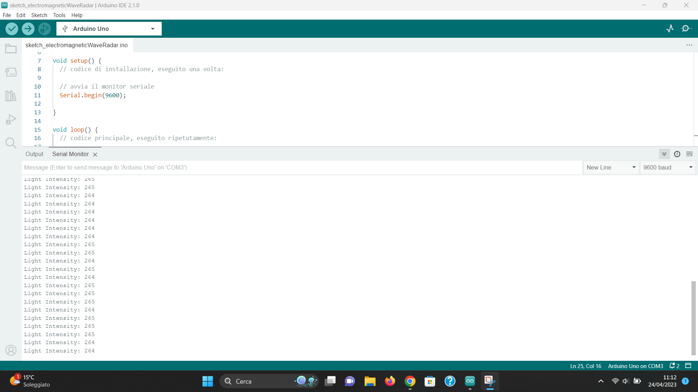
<sub>Fonte immagine: produzione propria dell'autore.</sub>

### Comunicazione ad onde luminose
Uno dei maggiori utilizzi delle onde elettromagnetiche è nel campo della comunicazione. Televisori, radio, telefoni cellulari, computer, dispositivi Bluetooth, robot e giocattoli telecomandati sono solo alcuni esempi di dispositivi che inviano e ricevono informazioni attraverso le onde radio. Ma non sono solo le onde radio che vengono utilizzate per la comunicazione. La tecnologia a **fibra ottica**, ad esempio, utilizza la luce per trasmettere grandi quantità di informazioni su lunghe distanze, a velocità molto elevate.
A differenza delle onde radio, che possono viaggiare attraverso l'aria e persino nello spazio, la fibra ottica richiede l'utilizzo di un cavo costituito da sottili fili in vetro o plastica. Un trasmettitore codifica un segnale elettrico e lo converte in impulsi digitali di luce laser. La luce viaggia attraverso il cavo ottico verso un ricevitore all'altra estremità che rileva, decodifica e converte gli impulsi luminosi nuovamente in segnali elettrici.

> Durante una lezione del corso di **Tecnico e sistemista di reti** i docenti ci hanno illustrato le procedure di base per l'installazione di impianti in fibra ottica. In particolare, abbiamo esplorato la struttura e la composizione di un cavo con all’interno un certo numero di fibre singole. Il cavo in fibra ottica generalmente contiene fibre singole nella quantità di 4, 8, 12, 16, 20 o 24, ma esistono anche tagli differenti. Normalmente, le fibre sono idenficate da rivestimenti di colore diverso. Successivamente, ci sono state mostrate le tecniche utilizzate per effettuare le giunzioni delle fibre ottiche mediante un'apposito macchinario. La giunzione permette di estendere la distanza di una precedente fibra o di spezzare una tratta molto lunga in più pezzi di cavo per poi collegarli. Generalmente, gli operatori del settore effettuano giunzioni di fibre quando è necessario attivare nuove utenze.

In questa attività, utilizzeremo un LED e un sensore di luce per simulare l'invio di informazioni attraverso onde luminose. Il LED inserito nel circuito funzionerà come una sorgente luminosa lampeggiante. Puntando il sensore di luce sul LED osserveremo come il sensore reagisce alla luce lampeggiante, correlando questo comportamento alla tecnologia in fibra ottica e alla trasmissione di informazioni attraverso le onde luminose.

All'interno dello sketch utilizzeremo il timer di Arduino per due diverse attività: la prima è quella di accendere e spegnere il LED per un certo periodo di tempo, la seconda è quella di eseguire misurazioni grazie al sensore di luce a determinati intervalli di tempo. Per accendere e spegnere il LED usiamo una variabile che attiva o disattiva il suo stato. Nel `void loop()` eseguiremo due compiti: il primo è quello di creare un trasmettitore che faccia lampeggiare la luce, il secondo è quello di creare un ricevitore che la rilevi. Le porzioni di codice saranno implementate mediante le funzioni `transmitter()` e `receiver()`.

```c++
// nome dei pin della scheda Arduino utilizzati dal circuito
const int sensorPin = A0;
const int LEDPin = 10;
 
// variabili dichiarate
int lightAmount = 0; // memorizza il valore analogico dal sensore di luce
long timerLED = 0;
long timerSensor = 0;
int toggleLED = 0;

void setup() {
  // codice di installazione, eseguito una volta:

  pinMode(LEDPin, OUTPUT);

  // avvia il monitor seriale
  Serial.begin(9600);

}

void loop() {
  // codice principale, eseguito ripetutamente:

  transmitter ();

  receiver ();

}

void transmitter (){
    // codice per la trasmissione di un segnale a intervalli di 4 secondi
    if (millis() >= timerLED + 2000) {
      toggleLED = !toggleLED;
      digitalWrite(LEDPin, toggleLED);
      timerLED = millis();
  }

}

void receiver (){
  // codice per ricevere segnali ogni 1000 millisecondi
  if (millis() >= timerSensor + 1000) {

    // legge il sensore di luce e memorizza la misura in una variabile
    lightAmount = analogRead(sensorPin);

    // informazioni di output al monitor seriale
    Serial.print("Light Intensity: ");
    Serial.println(lightAmount);

    timerSensor = millis();
    
  }
}

```
Attraverso il monitor seriale dell'IDE Arduino possiamo osservare la misurazione del sensore di luce. Puntiamo il sensore di luce verso il LED blu e osserviamo la lettura dal monitor seriale mentre il LED si accende e si spegne. Possiamo notare che avvicinando il sensore (fototransistor) al LED acceso aumenta l'intensità della luce. L'aumento è chiaramente visibile nelle misurazioni sul monitor seriale.

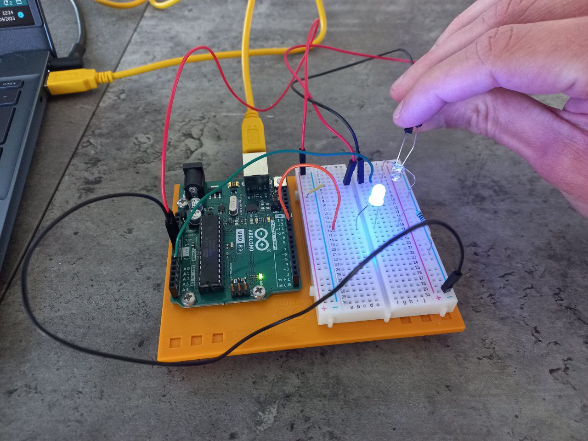
<sub>Fonte immagine: produzione propria dell'autore.</sub>

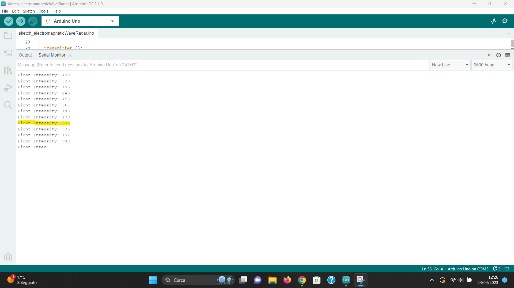
<sub>Fonte immagine: produzione propria dell'autore.</sub>

> Un po' di storia... dal telegrafo alla fibra ottica.

Il **telegrafo** fu il primo dispositivo in grado di trasmettere informazioni a lunghe distanze. I telegrafi inviavano messaggi su un filo di rame conduttivo utilizzando il codice Morse. In questo codice, ogni numero e ogni lettera dell'alfabeto sono rappresentati da una serie di punti e trattini. Questi punti e trattini erano trasmessi elettricamente, attraverso il filo, e ricevuti come clic e/o bip audio all'altra estremità.

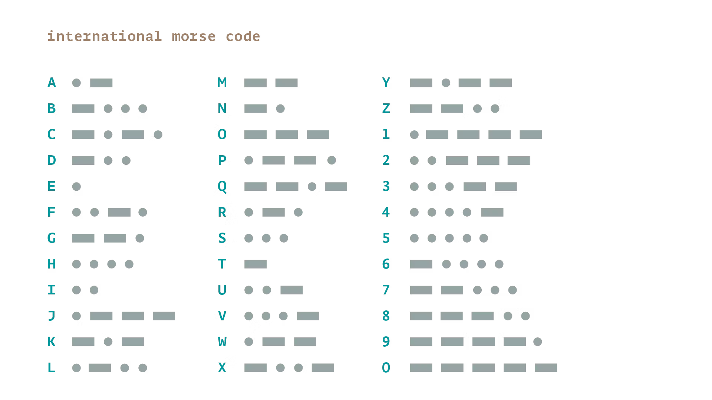
<sub>Fonte immagine: [Arduino Student Kit](https://www.arduino.cc/education/student-kit).</sub>

La fibra ottica funziona secondo lo stesso principio di base di un telegrafo. Tuttavia, con la fibra ottica, i dati vengono trasferiti con la luce attraverso un cavo costituito da sottili fili di vetro, anziché un segnale elettrico attraverso un filo di rame. Utilizzando questa codifica digitale, anziché il codice Morse, i cavi in fibra ottica possono trasmettere migliaia di telefonate, pagine Web, video, canzoni e qualsiasi media, in pochissimo tempo.

Il circuito appena costruito è molto simile a un sistema a fibra ottica ma con due differenze principali. Innanzitutto, un sistema a fibra ottica utilizza un cavo tra il trasmettitore (LED blu) e il ricevitore (sensore di luce) che impedisce alla luce di disperdersi su lunghe distanze. L'altra grande differenza è che, al fine di trasmettere grandi quantità di dati, il trasmettitore lampeggia molto velocemente, con impulsi diversi, per trasmettere i bit delle informazioni.

> Sai come fa la NASA a misurare la distanza dalla Luna?

La NASA utilizza un sistema simile al circuito appena costruito per misurare la distanza dalla Luna. Nel 1969, quando Neil Armstrong e Buzz Aldrin approdarono sulla Luna lasciarono qualcosa di più delle loro impronte nella polvere lunare. Si lasciarono infatti alle spalle un pannello catarifrangente per un esperimento con raggi laser - fondamentalmente, uno specchio puntato sulla Terra.
Tornati sulla Terra, con un forte laser puntato sullo specchio inviarono impulsi di luce che sfrecciano nello spazio alla velocità della luce. La luce laser si riflette così dallo specchio e ritorna sulla Terra, che viene rilevata dai telescopi. Usando la velocità della luce e il tempo impiegato dall'impulso laser per viaggiare fino alla Luna e ritorno, gli scienziati possono determinare con precisione la distanza tra la Terra e la Luna.

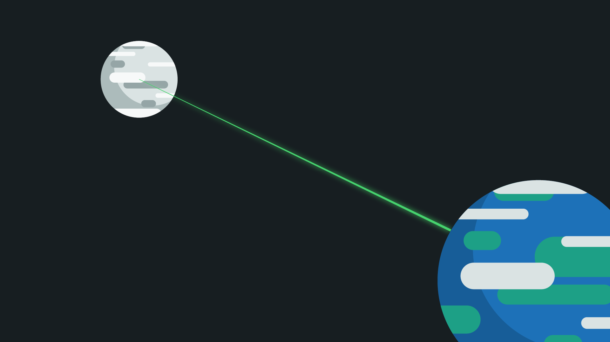
<sub>Fonte immagine: [Arduino Student Kit](https://www.arduino.cc/education/student-kit).</sub>

## Lo stato attuale della fibra ottica in Italia
Come riportato dalla rivista [Tom's Hardware](https://www.tomshw.it/business/cresce-copertura-fibra-ottica-italia/), l’[FTTH Council Europe](https://www.ftthcouncil.eu/), associazione di imprese con l’obiettivo di accelerare la diffusione della fibra ottica in Europa, ha presentato l’ultimo [report sullo stato delle reti Fiber To The Home](https://www.ftthcouncil.eu/knowledge-centre/all-publications-and-assets/1707/european-ftth-b-market-panorama-2023) nella regione europea.
I dati hanno rilevato un aumento del numero di case raggiunte dalla fibra: si è passati da 198,4 milioni nel settembre 2021 a 219 milioni nel settembre 2022 per la regione EU39. L’**Italia** è tra i Paesi che più degli altri hanno guidato questa crescita, registrando un aumento di 2.1 milioni di connessioni; insieme al nostro Paese troviamo il Regno Unito in vetta alla classifica (+4,2 milioni), la Francia (+3,5 milioni) e la Turchia (+2,9 milioni). In Italia il 56% delle abitazioni è raggiunto dalla fibra.
Il trend continua a essere in crescita da diversi anni ormai, ma c’è ancora un divario importante tra la copertura della fibra ottica e l’effettiva adozione: il tasso di take-up per EU39, definito come il numero di utenti in proporzione alle abitazioni raggiunte, è di quasi il 50%; nonostante i progressi degli ultimi anni.
Germania, Regno Unito e Italia contano il numero più alto di abitazioni senza abbonamento alla fibra: il totale dei tre Paesi è di 89 milioni di case senza connessioni FTTH attive. Per ottenere risultati soddisfacenti c’è ancora molto lavoro da fare.

## Invenzioni importanti
### Energia elettromagnetica
Tutte le moderne tecnologie di comunicazione trovano origine nelle teorie sull'elettromagnetismo e nella distribuzione dei segnali. È grazie a geni del passato come *Michael Faraday* e *James Clerk Maxwell* se oggi possiamo comunicare con qualcuno dall'altra parte del mondo semplicemente con un click sul nostro smartphone e avere una risposta in una frazione di secondo.

> *Faraday* è uno dei più grandi scienziati britannici di tutti i tempi e grazie al suo instancabile lavoro di ricerca pose le basi per tutti i successivi studi legati all’elettromagnetismo. Scopritore dell’induzione elettromagnetica, nonché di molteplici fenomeni fisici legati all’elettricità.

> *Maxwell*, colui che definì la luce. Fisico e matematico scozzese vissuto nel 19esimo secolo, è il padre della moderna teoria dell’elettromagnetismo e colui che per primo definì la luce come un’onda elettromagnetica in grado di muoversi anche nel vuoto. Grazie a quelle che oggi sono note come “equazioni di Maxwell”, lo scienziato permise di riunire in un unico modello i fenomeni elettrici e quelli magnetici.

Non si tratta ovviamente di contribuiti isolati... Molti altri scienziati hanno assunto ruoli fondamentali nello sviluppo e nella diffusione di queste tecnologie, fino ad arrivare al giorno d'oggi.

A partire dall'epoca di *Faraday* si fece strada una nuova immagine dell'universo. Gli scienziati avevano iniziato a sospettare, infatti, che le forze dell'elettricità e del magnetismo (insieme chiamate energia elettromagnetica) viaggiassero attraverso lo spazio come onde invisibili.

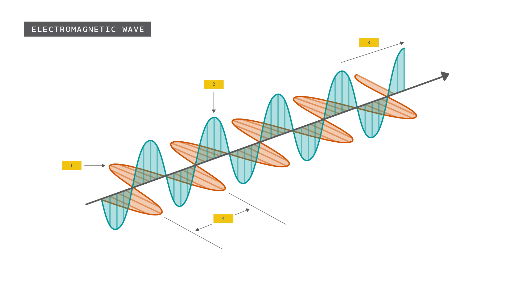
<sub>Fonte immagine: [Arduino Student Kit](https://www.arduino.cc/education/student-kit). Legenda: 1) Campo magnetico 2) Campo elettrico 3) Direzione di Propagazione 4) Lunghezza d'onda</sub>

Per riuscire a dimostrare questa teoria, *Heinrich Hertz*, ancora studente, divenne ossessionato dalla creazione di un esperimento. Nel 1887, creò un trasmettitore e un ricevitore elettrico. Il trasmettitore creava una scintilla elettrica che saltava tra due fili sotto tensione. La reazione che si creava è che il ricevitore emetteva una scintilla propria, anche se si trovava a diversi metri di distanza!
Questo, ed altri esperimenti di *Hertz*, dimostrarono che l'energia elettromagnetica viaggiava attraverso lo spazio, sotto forma di onde. Ciò sollevò una domanda interessante: con quale mezzo le onde elettromagnetiche si propagano? Come le onde dell'oceano viaggiano attraverso l'acqua, e le onde sonore viaggiano attraverso l'aria, cosa accadeva per le onde elettromagnetiche?
Ai tempi di *Hertz*, gli scienziati immaginarono un mezzo che chiamarono "etere luminifero". Ma nel 20° secolo, gli esperimenti dimostrarono che tale etere non esisteva. Oggi, gli scienziati credono che le onde elettromagnetiche semplicemente non abbiano necessità di un "mezzo" per propagarsi. Dalla scoperta di *Hertz*, però, emersero anche altri misteri profondi. Per esempio, si è scoperto che in alcune situazioni le onde si comportano invece come particelle. Tutt'oggi, molti aspetti di questi studi sono fortemente dibattuti.
Sebbene le scoperte successive abbiano complicato il quadro, la scoperta di *Hertz* fu una svolta incredibile. Ma, come spesso accade, la sua importanza non fu totalmente compresa al momento, nemmeno dallo stesso *Hertz*. La sua scoperta alla fine portò alla creazione di strumenti come la radio, la televisione, al radar e molto altro ancora. Tuttavia, quando fu chiesto a *Hertz* l'utilità della sua scoperta, lui rispose: "Non serve a niente". Purtroppo, *Hertz* morì troppo giovane per vedere il suo immenso contributo alla tecnologia.

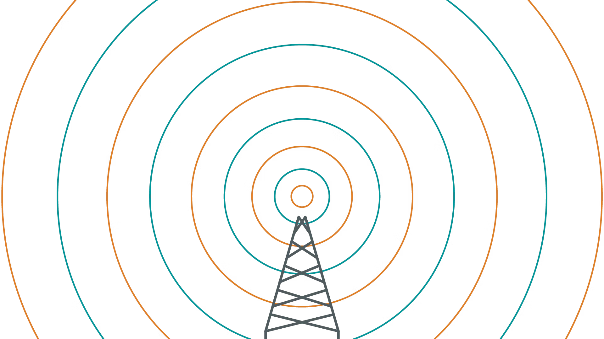
<sub>Fonte immagine: [Arduino Student Kit](https://www.arduino.cc/education/student-kit). </sub>

Ci sono voluti altri grandi geni per mettere in pratica la sua scoperta. L'inventore e uomo d'affari *Guglielmo Marconi*, ad esempio, si guadagnò il suo posto nella storia dimostrando che queste onde potevano essere utilizzate per comunicare. Andando contro il volere del padre, il giovane *Marconi* eseguì i suoi esperimenti. Le distanze alle quali riuscì ad inviare e ricevere le sue onde crebbero da pochi metri, alla distanza che attraversa un oceano.
Come avrete intuito, *Marconi* fu il pioniere della trasmissione radiofonica. Ma, i primi investitori a mostrare interesse per i sistemi di trasmissione di *Marconi*, furono i corpi della Marina. La radio offriva, infatti, alle navi un miglior metodo di segnalazione, anche per l'invio di richieste d'aiuto.
*Marconi* sviluppò anche un'altra tecnologia utile alla Marina: il **radar**. Le onde elettromagnetiche rimbalzano infatti su alcune superfici. Gli operatori radar inviano un impulso e quindi rilevano se le onde si riflettono e tornano indietro. Questa operazione rivela se ci sono o meno oggetti. È anche possibile calcolare la distanza da questo oggetto, misurando il tempo del ritorno.

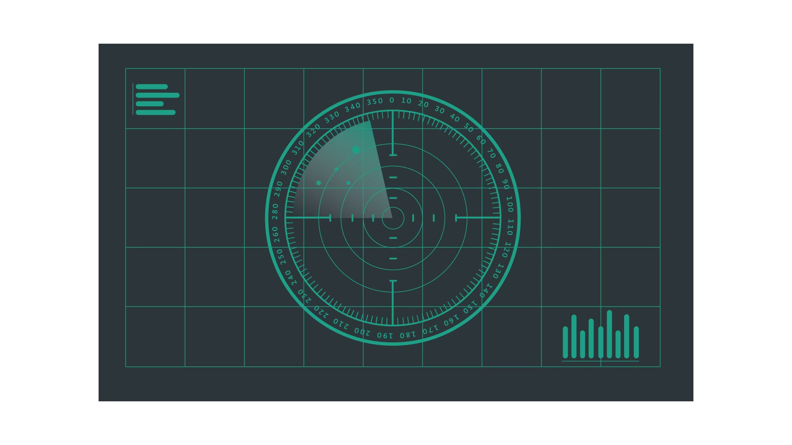
<sub>Fonte immagine: [Arduino Student Kit](https://www.arduino.cc/education/student-kit). </sub>

Mentre *Hertz* non visse sufficientemente a lungo per comprendere e godere a pieno del suo contributo scientifico, *Marconi* divenne sinonimo di radio già ai suoi tempi. Qualche anno dopo, un altro innovatore ottenne grande fama, anche se non per le sue importanti invenzioni. Nonostante *Hedy Lamarr* fosse una star del cinema di fama mondiale, pochi infatti conoscevano le sue invenzioni. *Lamarr* progettò un miglioramento del semaforo, suggerì modifiche alla progettazione di velivoli sperimentali e, in particolare, contribuì alla tecnologia a spettro espanso.
Durante la Seconda Guerra Mondiale, *Lamarr* venne a sapere che i siluri americani, pilotati da onde radio, potevano essere bloccati dalle imbarcazioni nemiche. Le barche emettevano infatti un segnale radio opposto, che confondeva il siluro. Lavorò quindi insieme ad un pianista (*George Antheil*) per sviluppare un sistema di guida ad onde radio, che variasse da una frequenza all'altra. Il segnale, che continuava a modificarsi, era molto più difficile da bloccare. Utilizzarono un rullo di un pianoforte per selezionare le frequenze di comunicazione. Di conseguenza, il loro sistema offriva 88 frequenze, proprio come gli 88 tasti che ci sono su di un pianoforte.
All'inizio i militari non furono interessati a questa tecnologia a spettro espanso, anche se decenni dopo, ne fecero largo uso. Non solo questo però, la tecnica aprì la strada alla tecnologia oggi utilizzata nelle comunicazioni via cellulare e **Wi-Fi**.

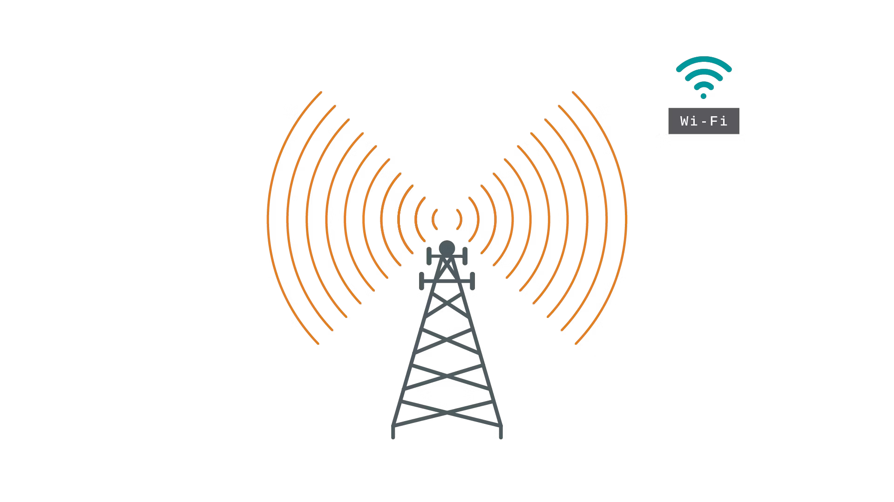
<sub>Fonte immagine: [Arduino Student Kit](https://www.arduino.cc/education/student-kit). </sub>

## Parte 2 - Radar di onde luminose
Oltre alla comunicazione, le onde elettromagnetiche vengono oggi utilizzate in vari modi. I forni a microonde riscaldano il cibo emettendo appunto microonde dirette al cibo. Le onde a infrarossi vengono utilizzate nei telecomandi per controllare ad esempio i televisori. I raggi gamma sono spesso usati come forma di trattamento per uccidere le cellule tumorali. I controllori del traffico aereo utilizzano le onde radar e radio per mappare la posizione degli aerei nel cielo e gestire il flusso degli aerei che entrano e escono dagli aeroporti.

Sebbene la maggior parte dei sistemi radar utilizzino le onde radio per tracciare gli oggetti, alcuni sistemi chiamati lidar usano la luce laser. Come i sistemi radar, i sistemi lidar vengono utilizzati per creare mappe con la distanza dagli oggetti. Tuttavia, non utilizzeremo i laser in questa attività; creeremo e programmeremo un dispositivo che rileva la luce più o meno allo stesso modo in cui il radar rileva le onde radio o il lidar rileva la luce laser. Il nostro radar a onde luminose utilizzerà un servo motore per puntare il fototransistor nella stanza, misurando l'intensità della luce.

### Componenti necessari
- 1 circuito sensore di luminosità dell'esperimento precedente
- 1 condensatore 100 μf
- 1 servomotore
- nastro adesivo
- cavi jumper aggiuntivi

### Schema elettrico
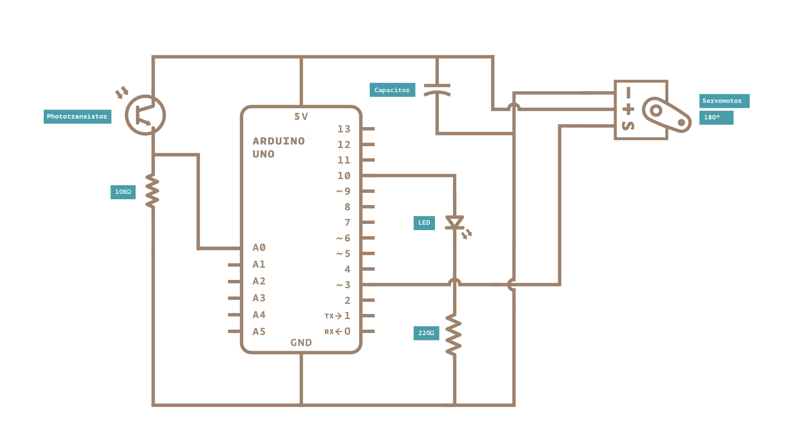
<sub>Fonte immagine: [Arduino Student Kit](https://www.arduino.cc/education/student-kit).</sub>

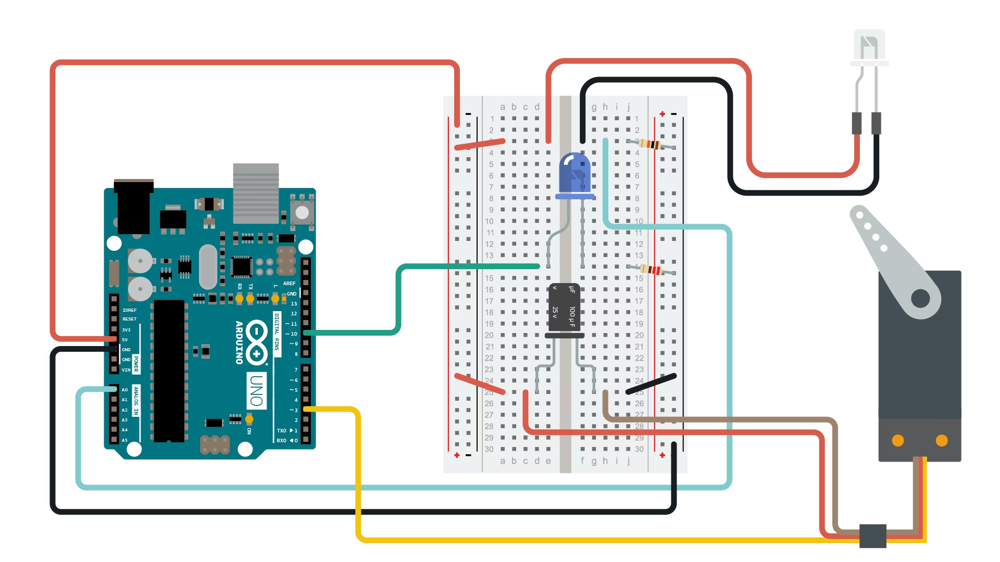
<sub>Fonte immagine: [Arduino Student Kit](https://www.arduino.cc/education/student-kit).</sub>

Circuito costruito con servo motore.

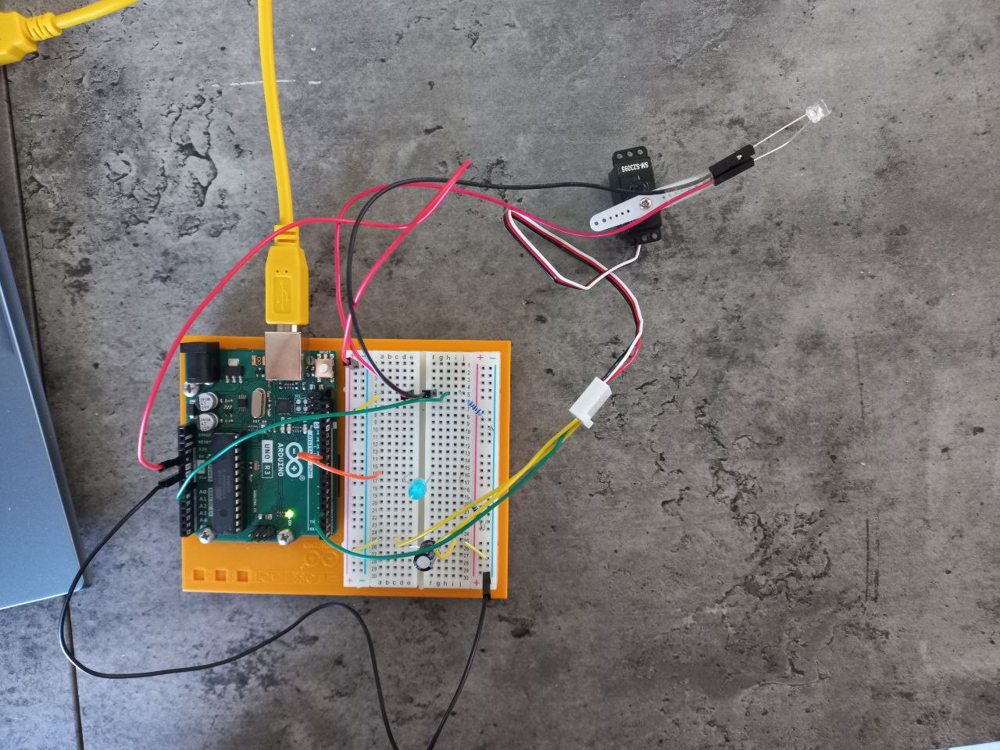
<sub>Fonte immagine: produzione propria dell'autore.</sub>

### Scansione manuale della luce
In questo esperimento, programmeremo il radar a onde luminose per scansionare la stanza e mappare la luce ambientale. Il sistema radar ad onde luminose costruito sarà uno scanner manuale che si muove leggendo i comandi attraverso il monitor seriale. Aumenteremo l'angolo del servo inviando un segno più (+) e lo diminuiremo inviando un segno meno (-).

Nota: per chi non lo sapesse, è bene precisare che il monitor seriale dell'IDE Arduino può essere utilizzato sia come uno strumento di output per visualizzare informazioni e dati, sia per inserire informazioni e dire alla scheda Arduino UNO R3 cosa fare. Si parla in questo secondo caso di input seriali.

Dopo aver inserito il servo nel circuito, è necessario importare la [libreria servo di Arduino](https://github.com/arduino-libraries/Servo) nello sketch, digitando il comando `#include <Servo.h>` all'inizio dello sketch. Per memorizzare l'angolo del servo e per memorizzare i dati immessi dal monitor seriale avremo bisogno di inserire due nuove variabili: `servoAngle` e `inputCommand`. Nella parte inziale dello sketch dovremo inoltre creare un oggetto servo, che chiamiamo `myServo`.
La funzione `void loop` inizia controllando se sono stati inviati e archiviati dati nel buffer seriale (memoria volatile del microcontrollore della scheda Arduino UNO R3). Il comando `Serial.available()` verificherà se ci siano o meno dati memorizzati. Se ci sono dati memorizzati nel buffer, il comando restituirà uno 1. Se il buffer seriale invece è vuoto, restituirà uno 0. Nel caso in cui ci siano dati memorizzati nel buffer, lo sketch allora dovrà eseguire alcuni comandi. Inserendo questo comando in un'istruzione if, lo sketch allora eseguirà altri comandi se il buffer contiene dati. Se ci sono dati memorizzati nel buffer seriale, dovranno essere letti. Il comando `Serial.read()` esamina il primo byte di dati nel buffer seriale, in altre parole, legge il primo carattere immesso nel monitor seriale e restituisce il valore in byte di quel carattere. Programmeremo Arduino in modo che accetti due differenti comandi dal monitor seriale: un comando per aumentare l'angolo del servo e un comando per ridurlo. Come anticipato, utilizziamo un segno più (+) per aumentare l'angolo e un segno meno (-) per ridurlo.
Arduino procederà con due comportamenti diversi a seconda del comando immesso (+ o -) nel monitor seriale. È possibile utilizzare una funzione `switch-case` sulla variabile `inputCommand` per definire ciascun comportamento.
È importante tenere a mente che il servo motore ha un angolo massimo di rotazione di 180°;  dovremo quindi scrivere una condizione che imposti il `servoAngle` al massimo, cioè 180 se la variabile `servoAngle` è maggiore o uguale a 180. Per evitare di sbagliarci, creeremo una sorta di indicatore visivo per segnalare quando il servo raggiunge il suo limite: useremo come indicatore un LED all'interno del circuito.
Ogni volta che il servo di sposta, in seguito ai comandi inviati, la misurazione del sensore di luce sarà letta mediante comando `analogRead()` e il valore sarà visibile sul monitor seriale dell'IDE Arduino. Si osserverà come il valore di misurazione cambia con il variare dell'angolo del servo motore.

```c++
// aggiunita della Servo library
#include <Servo.h>

// nome dei pin della scheda Arduino utilizzati dal circuito
const int sensorPin = A0;
const int servoPin = 3;
const int LEDPin = 10;
 
// variabili dichiarate
int lightAmount = 0; // memorizza il valore analogico dal sensore di luce
int servoAngle = 0;
int inputCommand = 0;

Servo myServo;  // crea un oggetto servo

void setup() {
  // codice di installazione, eseguito una volta:

  pinMode(LEDPin, OUTPUT);

  // avvia il monitor seriale
  Serial.begin(9600);

  myServo.attach(servoPin);   // collega il servo sul pin 3 all'oggetto servo
  myServo.write(servoAngle);  // sposta il servo nella posizione iniziale
  delay(1000);

}

void loop() {
  // codice principale, eseguito ripetutamente:

  // controlla se ci sono dati nel buffer seriale
  if (Serial.available() > 0) {
    // legge il primo byte e cancella dal buffer
    inputCommand = Serial.read();

    switch (inputCommand){
      case '+':
      // aumenta l'angolo del servo di 10 gradi
      servoAngle = servoAngle + 10;
      // assicurarsi che l'angolo sia entro i limiti di 180 gradi del servo, altrimenti fai lampeggiare il LED blu come indicatore del limite
      if (servoAngle >= 180) {
        servoAngle = 180;
        digitalWrite(LEDPin, HIGH);
        delay(1000);
        digitalWrite(LEDPin, LOW);
      }
      break;
      case '-':
      // diminuisce l'angolo del servo di 10 gradi
      servoAngle = servoAngle - 10;
      // assicurarsi che l'angolo sia entro il limite minimo di 0 gradi del servo, altrimenti fai lampeggiare il LED blu come indicatore del limite
      if (servoAngle <= 0) {
        servoAngle = 0;
        digitalWrite(LEDPin, HIGH);
        delay(1000);
        digitalWrite(LEDPin, LOW);
      }
      break;
      // la variabile deve rimanere sempre all'interno dell'intervallo del servo (0-180 gradi)
    }

    // sposta il servo nell'angolo corretto
    myServo.write(servoAngle);
    delay(1000);

    // legge il sensore di luce e memorizza la misura in una variabile
    lightAmount = analogRead(sensorPin);

    Serial.print("Angle: ");
    Serial.print(servoAngle);
    Serial.print("     Light Intensity: ");
    Serial.println(lightAmount);
  }
}

```
I commenti inseriti nel codice dovremmo aiutare il lettore a comprendere ogni passaggio dell'esperimento. Nelle immagini e negli screenshot seguenti viene rappresentato cosa succede al circuito e le misurazioni visibili nel monitor seriale durante l'esecuzione del codice.
Nell'ultima immagine si vedrà l'accensione del LED che segnala il raggiungimento del limite dell'angolo del servo.

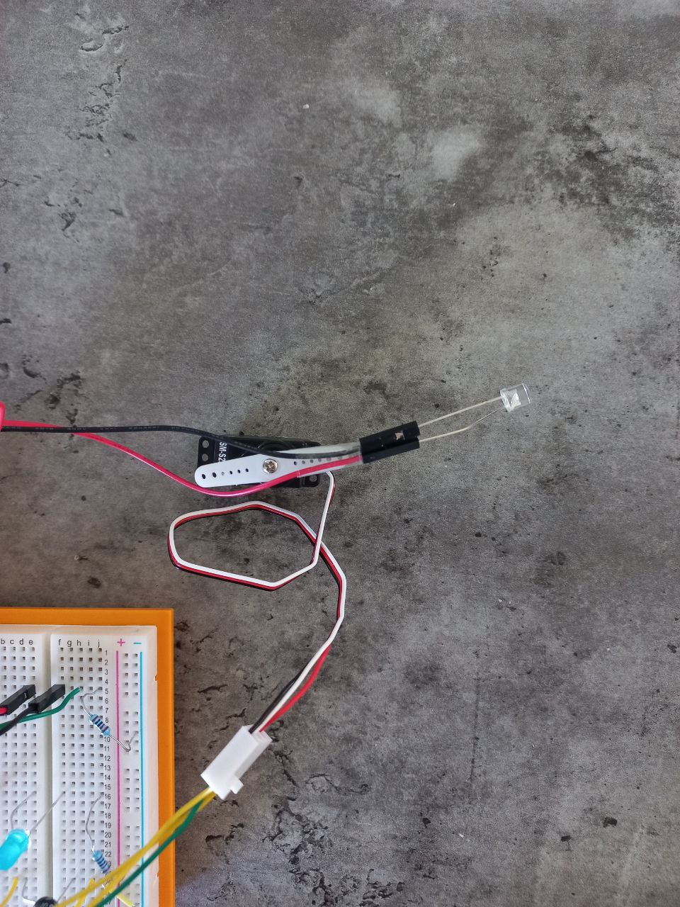
<sub>Fonte immagine: produzione propria dell'autore.</sub>

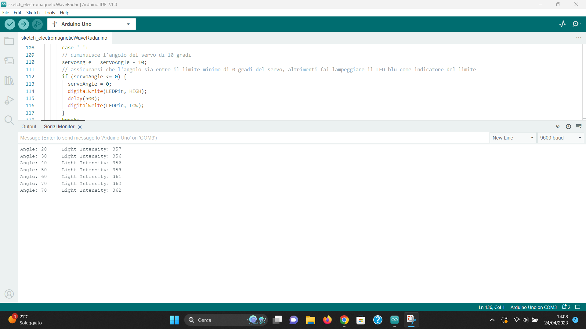
<sub>Fonte immagine: produzione propria dell'autore.</sub>

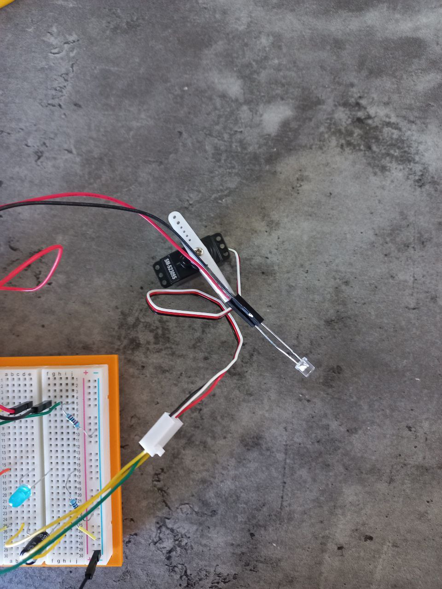
<sub>Fonte immagine: produzione propria dell'autore.</sub>

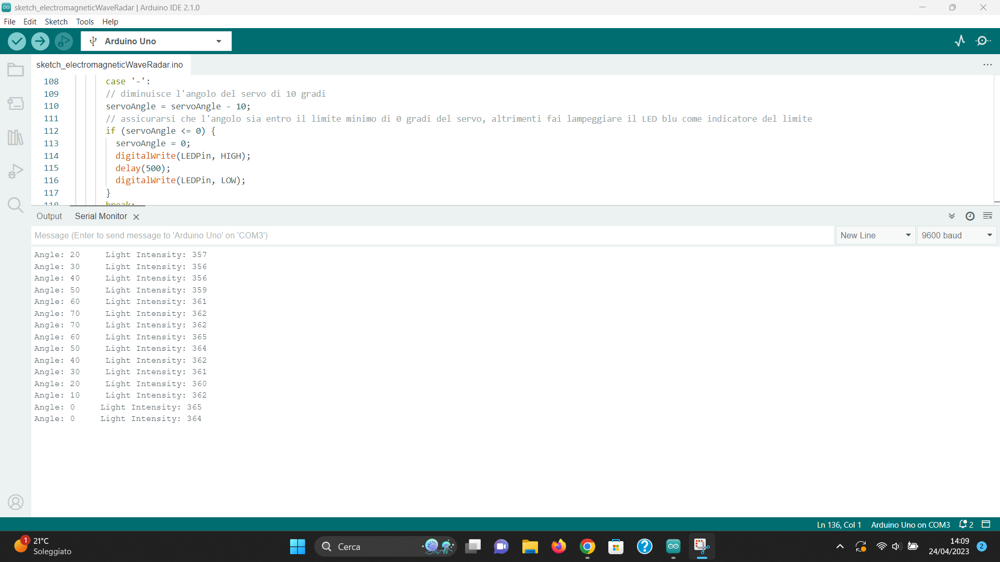
<sub>Fonte immagine: produzione propria dell'autore.</sub>

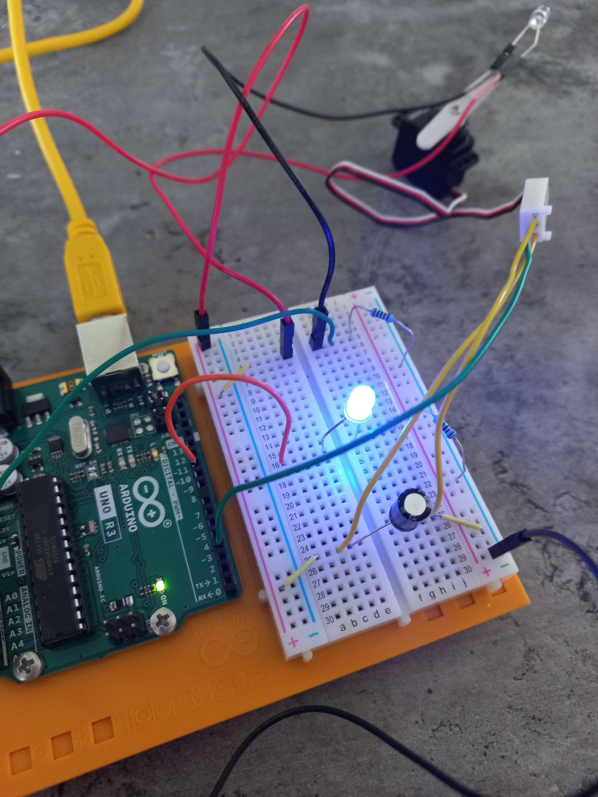
<sub>Fonte immagine: produzione propria dell'autore. Nota: il LED è accesso perchè il servo ha raggiunto il limite dell'angolo di 180°.</sub>

Spero che il progetto sia piaciuto ai lettori. Grazie :grin:


 
